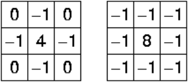
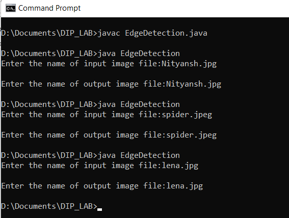
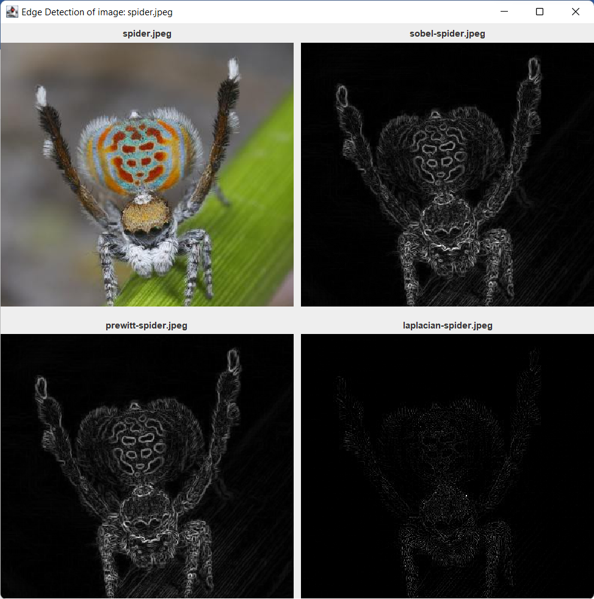
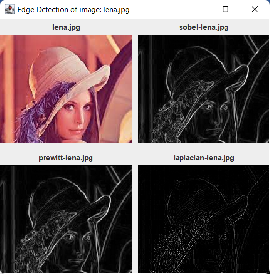

# Edge Detection

Edges are significant local changes of intensity in a digital image. An edge can be defined as a set of connected pixels that forms a boundary between two disjoint regions. There are three types of edges:

-   **Horizontal edges**
-   **Vertical edges**
-   **Diagonal edges**

Edge Detection is a method of segmenting an image into regions of discontinuity. It is a widely used technique in digital image processing like

-   **pattern recognition**
-   **image morphology**
-   **feature extraction**

Edge detection allows users to observe the features of an image for a significant change in the gray level. This texture indicating the end of one region in the image and the beginning of another. It reduces the amount of data in an image and preserves the structural properties of an image.

Edge Detection Operators are of two types:

-   **Gradient** – based operator which computes first-order derivations in a digital image like, Sobel operator, Prewitt operator, Robert operator.
-   **Gaussian** – based operator which computes second-order derivations in a digital image like, Canny edge detector, Laplacian of Gaussian.

**Sobel Operator**

It is a discrete differentiation operator. It computes the gradient approximation of image intensity function for image edge detection. At the pixels of an image, the Sobel operator produces either the normal to a vector or the corresponding gradient vector. It uses two 3 x 3 kernels or masks which are convolved with the input image to calculate the vertical and horizontal derivative approximations respectively –

**Advantages:**

-   Simple and time efficient computation
-   Very easy at searching for smooth edges

**Limitations:**

-   Diagonal direction points are not preserved always
-   Highly sensitive to noise
-   Not very accurate in edge detection
-   Detect with thick and rough edges does not give appropriate results

**Prewitt Operator**

This operator is almost similar to the sobel operator. It also detects vertical and horizontal edges of an image. It is one of the best ways to detect the orientation and magnitude of an image. It uses the kernels or masks –

**Advantages:**

-   Good performance on detecting vertical and horizontal edges
-   Best operator to detect the orientation of an image

**Limitations:**

-   The magnitude of coefficient is fixed and cannot be changed
-   Diagonal direction points are not preserved always

**Laplacian Operator**

Laplacian is somewhat different from the methods we have discussed so far. Unlike the Sobel and Prewitt’s edge detectors, the Laplacian edge detector uses only one kernel. It calculates second order derivatives in a single pass. Two commonly used small kernels are:

Because these masks are approximating a second derivative measurement on the image, they are very sensitive to noise. To correct this, the image is often Gaussian smoothed before applying the Laplacian filter.

## EXECUTION STEPS:

To run the code first compile the file as:

**javac EdgeDetection.java**

Followed by

**java Edge**

## OUTPUT:

### Execution

### Edge Detection of spider.jpeg

### Edge Detection of lena.jpg

