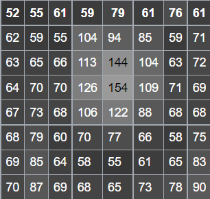

**Introduction to Histogram Equalization**

Image pre-processing is the term for operations on the images at the lowest level of abstraction. These operations do not increase image information content, but they decrease it if entropy is an information measure. The aim of pre-processing is an improvement of the image data that suppresses undesired distortions or enhances some image features relevant for further processing and analysis tasks.

There are four different types of Image Pre-Processing techniques, and they are listed below.

-   Pixel brightness transformations/ Brightness corrections
-   Geometric Transformations
-   Image Filtering and Segmentation
-   Fourier transform and Image restoration

Histogram equalization is one of the Pixel brightness transformations techniques. It is a well-known contrast enhancement technique due to its performance on almost all types of image.

**Histogram equalization**

A histogram is a representation of frequency distribution. It is the basis for numerous spatial domain processing techniques. Histogram manipulation can be used for image enhancement.

Contrast is defined as the difference in intensity between two objects in an image. If the contrast is too low, it is impossible to distinguish between two objects, and they are seen as a single object.

Histogram equalization is a widely used contrast-enhancement technique in image processing because of its high efficiency and simplicity. It is one of the sophisticated methods for modifying the dynamic range and contrast of an image by altering that image such that its intensity histogram has the desired shape. It can be classified into two branches as per the transformation function is used.

-   Global histogram equalization (GHE)
-   Local histogram equalization (LHE)

**Example:**

****

The 8-bit grayscale image shown has the following values:

The histogram for this image is shown in the following table. Pixel values that have a zero count are excluded for the sake of brevity.

The cumulative distribution function (cdf) is shown below. Again, pixel values that do not contribute to an increase in the cdf are excluded for brevity.

 

This cdf shows that the minimum value in the subimage is 52 and the maximum value is 154. The cdf of 64 for value 154 coincides with the number of pixels in the image. The cdf must be normalized to **[0,255].** The general histogram equalization formula is:

where cdfmin is the minimum non-zero value of the cumulative distribution function (in this case 1), M × N gives the image's number of pixels (for the example above 64, where M is width and N the height) and L is the number of grey levels used (in most cases, like this one, 256).

Note that to scale values in the original data that are above 0 to the range 1 to L-1, inclusive, the above equation would instead be:

where cdf(v) \> 0. Scaling from 1 to 255 preserves the non-zero-ness of the minimum value.

The equalization formula for the example scaling data from 0 to 255, inclusive, is:

For example, the cdf of 78 is 46. (The value of 78 is used in the bottom row of the 7th column.) The normalized value becomes

Once this is done then the values of the equalized image are directly taken from the normalized cdf to yield the equalized values:

Notice that the minimum value (52) is now 0 and the maximum value (154) is now 255.

**EXECUTION STEPS:**

To run the code first compile the file as:

**javac HistogramEqualization.java**

Followed by

**java HistogramEqualization**

**OUTPUT:**

**Execution**

**Histogram equalization of Unequalized.jpg**

**Histogram equalization of tiles.png**

**Histogram Equalization of place.jpg**

