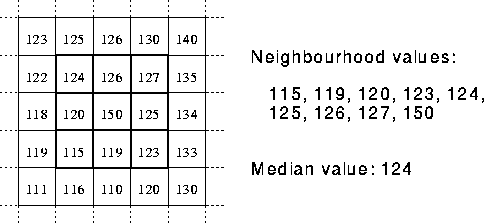
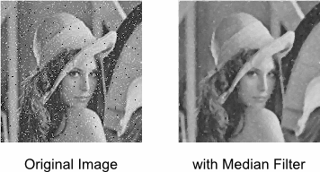
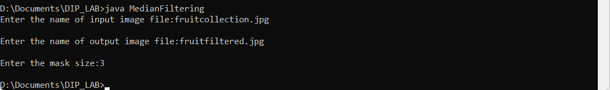
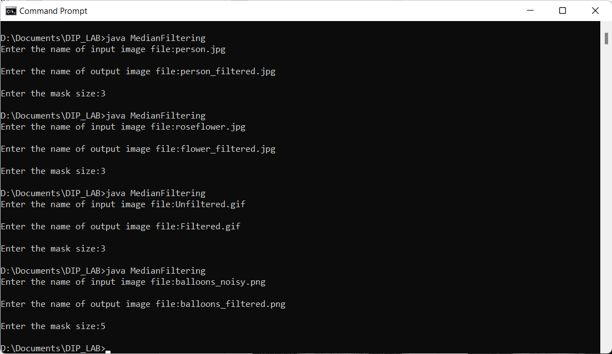
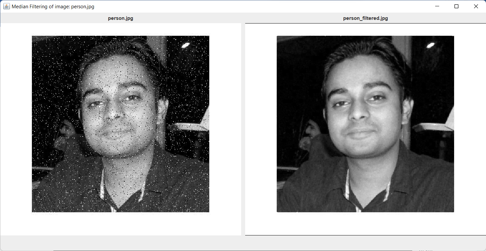
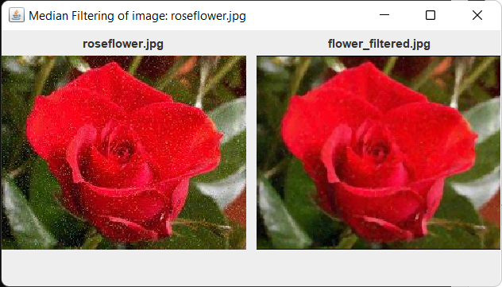
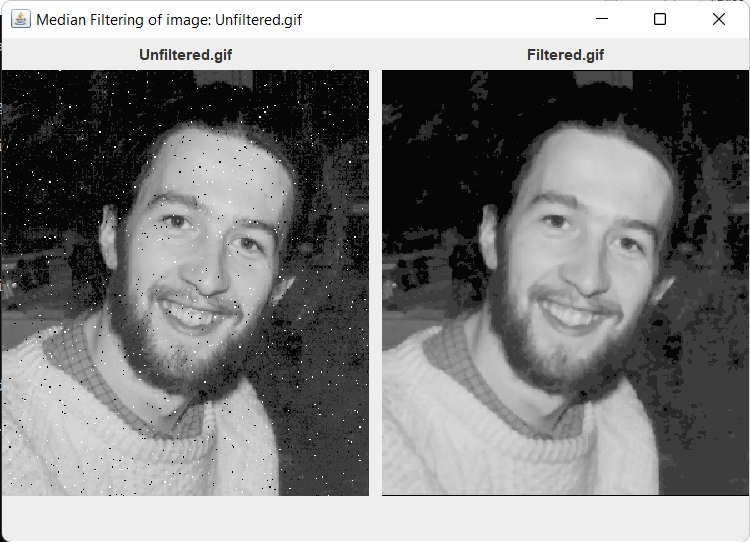
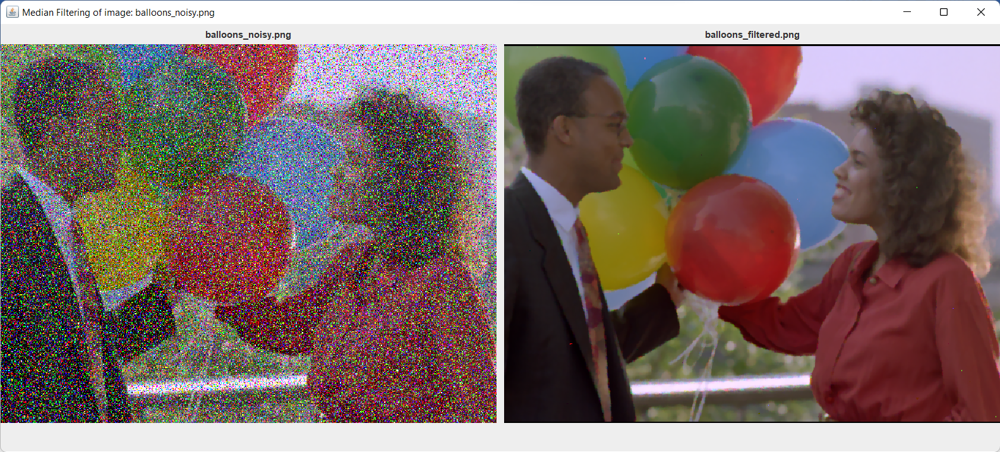
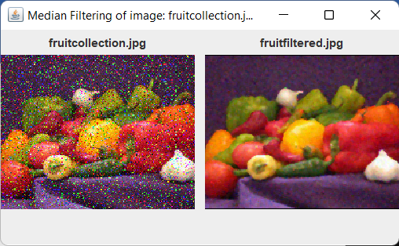

# Image Filtering

Filtering techniques are used to enhance and modify digital images. Also, images filters are used to blurring and noise reduction , sharpening and edge detection. Image filters are mainly used for suppressing high (smoothing techniques) and low frequencies(image enhancement, edge detection).

Image filters can be classified as linear or nonlinear.

**Linear filters** are also known as convolution filters as they can be represented using a matrix multiplication.

Thresholding and image equalisation are examples of **nonlinear** operations, as is the median filter.

## Median Filtering

-   Median filtering is a nonlinear method used to remove noise from images.
-   It is widely used as it is very effective at removing noise while preserving edges.
-   It is particularly effective at removing ‘salt and pepper’ type noise.
-   The median filter works by moving through the image pixel by pixel, replacing each value with the median value of neighbouring pixels.
-   The pattern of neighbours is called the "window", which slides, pixel by pixel over the entire image.
-   The median is calculated by first sorting all the pixel values from the window into numerical order, and then replacing the pixel being considered with the middle (median) pixel value.

The median filter considers each pixel in the image in turn and looks at its nearby neighbours to decide whether or not it is representative of its surroundings. Instead of simply replacing the pixel value with the mean of neighbouring pixel values, it replaces it with the median of those values. The median is calculated by first sorting all the pixel values from the surrounding neighbourhood into numerical order and then replacing the pixel being considered with the middle pixel value. (If the neighbourhood under consideration contains an even number of pixels, the average of the two middle pixel values is used.) The below figure illustrates an example calculation.

Calculating the median value of a pixel neighbourhood. As can be seen, the central pixel value of 150 is rather unrepresentative of the surrounding pixels and is replaced with the median value: 124. A 3×3 square neighbourhood is used here --- larger neighbourhoods will produce more severe smoothing.

The median filter has two main advantages over the mean filter:

-   The median is a more robust average than the mean and so a single very unrepresentative pixel in a neighbourhood will not affect the median value significantly.
-   Since the median value must actually be the value of one of the pixels in the neighbourhood, the median filter does not create new unrealistic pixel values when the filter straddles an edge. For this reason the median filter is much better at preserving sharp edges than the mean filter.

### Example

## EXECUTION STEPS:

To run the code first compile the file as:

**javac MedianFiltering.java**

Followed by

**java MedianFiltering**

## OUTPUT:

### Execution

### Median Filtering of person.jpg

### Median Filtering of roseflower.jpg

### Median Filtering of Unfilterd.gif

### Median Filtering of balloons_noisy.png

### Median Filtering of fruitcollection.jpg

